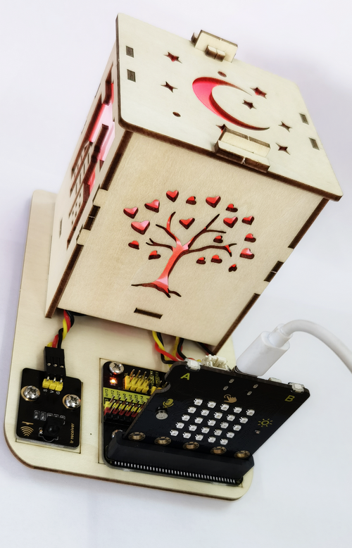
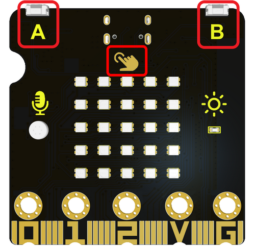
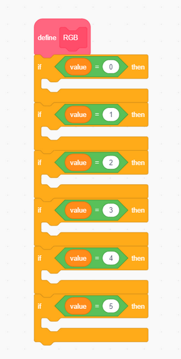
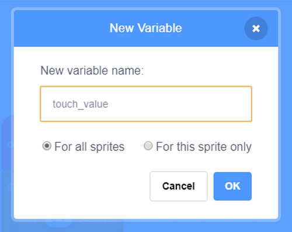
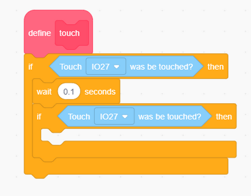
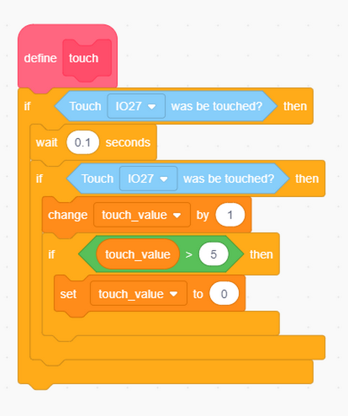
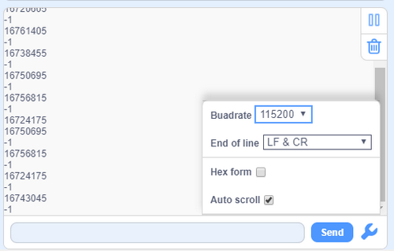

# ESP32 Easy Coding Board Colorful Lamp Projects

## 1. Projects

Code download:  [Code](Code/code.zip)

### 1.1 RGB Module

#### 1.1.1 Description

6812 2x2 full-color RGB module can be regarded as an intelligent external controlled LED light source, which integrates a control circuit and a light emitting circuit. Each pixel on it can be driven individually. Because it adopts single-line communication, this module can be controlled by only one signal pin.

#### 1.1.2 Schematic Diagram

#### 1.1.3 Parameters

- Operating voltage: DC3.3 or 5V
- Current: ≤200mA（MAX）
- Grey levels: 256 levels
- Emitting angle: 180°

#### 1.1.4 Wiring Diagram

The RGB drive method of the main board is the same as that of this module. 5x5 RGB dot matrix on the board is connected to pin io13, while the RGB module is wired to io32. If you require the 5X5 dot matrix to display lights at the same time as the RGB module, connect the module to the pin io13 as well. 

#### 1.1.5 Test Code 1

Initialize RGB module.

Connect the module to pin io32.

Light up four RGB pixels.

Set pixel number to 4.

Set a color.

**Complete code**:

#### 1.1.6 Light Effect 1

Upload the code to the board.

The lamp will light up in the color you set.

#### 1.1.7 Test Code 2

Initialize RGB module.

Set module pin, brightness and lighting duration.

**Complete code**:

#### 1.1.8 Light Effect 2

Upload the code to the board.

The lamp will turn on in colorful lights.

------

### 1.2. Button Control Lamp

There are two buttons (A and B) and a touch logo on the board. In this experiment, we change light colors with button A and B, and adjust brightness by touching the logo.

#### 1.2.1 Test Code 1

Define a variable to store the button value.

Define a function.

Set button value to 0 and initialize the serial port.

In the button function, determine whether the button is pressed. We delay 0.1 seconds to eliminate the button jitters. 

When the button is detected to be pressed, we add a delay time (such as 100ms) to avoid jitters, and the button state will be detected again. If the it is still pressed, it is considered to be pressed.

The button value is set within 0-5. Press button A, value minus 1.

Press button B, value minus 1.

**Button function**:

Put the button function in "forever", print the button value.

**Complete code**:

#### 1.2.2 Test Result 1

Upload the code to the board.

Open the serial monitor and set baud rate, and the button value will be printed on it.

#### 1.2.3 Test Code 2

Based on last experiment, we add RGB module to form light show.

Create an RGB function.

Set colors of the lamp.

**RGB Function**:

Create a touch function.

Define a variable.

Assign an initial value of 0 to the variable.

Determine whether the logo is touched.

As follows:

Set brightness.

**Touch Function**:

Put the three functions in "forever".

**Complete code**:

#### 1.2.4  Light Effect 2

Upload the code to the board.

Press button A or B to change the color of the lamp; touch the logo to adjust its brightness.

------

### 1.3. Remote Control Lamp

#### 1.3.1 Description

Infrared remote control is one of the most widely used means of communication and remote control. This IR receiver module features small size, low power consumption, strong function and low cost, so it is adopted in many toys, such as the recorders, audio devices and air conditioners.

The transmitting circuit in the IR receiver is composed of an infrared light-emitting diode, which is responsible for emitting the modulated infrared waves.

The receiving circuit includes an infrared receiving diode and a triode/a silicon photocell, which receives the modulated infrared waves emitted by the transmitter and then converts them into electrical signals. These signals are then amplified, filtered, and demodulated to restore the encoded instructions. After being decoded, they will be read and recognized by the main board to perform the corresponding operations.

#### 1.3.2 Parameters

Operating voltage: DC 3.3 ~ 5V

Operating Current: 1.5 mA

Maximum power: 0.0075 W

Carrier frequency: 38 KHz

Wave length: 940 λp（nm）

Receiving distance: 6m at 45 degree, 14m in parallel. 

Operating temperature: -10°C ~ +50°C

#### 1.3.3 Wiring Diagram

#### 1.3.4 Test Code 1

Import IR module library.

Search “ir”

Load the library.

Define an int variable.

Initialization.

Determine whether infrared values are received.

Assign the received infrared value to variable “item“,  and print it on the monitor.

#### 1.3.5 Test Result 1

Upload the code to the board.

Open the serial monitor and set baud rate. Align the remote control with the infrared receiver and press the buttons, and corresponding values will be received and displayed.

Corresponding button codes:

#### 1.3.6 Test Code 2

We extend some codes on the basis of the previous program.

Define two variables.

Initialization.

Create a function **LUM** to control the brightness.

Create a function **RGB** to control the light color.

In this experiment, only button 1-5 are used.

Set **rgb_value** to a specified button value based on the received button codes.

Set corresponding colors.

The up and down button are adopted to control the brightness.

Press button ↑ increase brightness; press button ↓ to decrease brightness.

lum_value < 0: set it to 0

lum_value > 255: set it to 255

**lum_value** should be within 0-255.

**Complete code**:

#### 1.3.7  Light Effect 2

Upload the code to the board.

Press the up and down button to control the brightness; press the button 1-5 to change the colors of the light.

------

### 1.4. Sound Control Lamp

The board integrates a microphone which can detects ambient sound. 

In this experiment, we build a smart lamp. When a human makes a sound and it is detected, the lamp automatically turn on.

------

#### 1.4.1 Test Code 1

Initialize the serial port.

Print the microphone value.

#### 1.4.2 Test Result 1

Upload the code to the board.

Open serial monitor and set baud rate. Clap your hand to make sound, and the monitor displays the sound values. 

#### 1.4.3 Test Code 2

We add a duration of the lighting time on the basis of the previous experiment. When we make a sound, the lamp lights up for 10s. 10 seconds later, the lamp will turn off if no sound is detected.

**Complete code**:

#### 1.4.4  Light Effect 2

Upload the code to the board. When we make a sound, the lamp lights up for 10s. 10 seconds later, the lamp will turn off if no sound is detected.

------

## 2.FAQ

### Q: Battery Model?

A: Four AAA batteries. Please mount batteries in the right direction! Please do not reverse them! For younger students, please do those experiments accompanied by your parents!

------

### Q: Errors occur during burning codes to ESP32 board?

A: 

- Please check the USB port.
- Please check the board model.

------

### Q: Extend to other modules?

A: Yes. For details, please refer to the pin-out description of ESP32 board, making sure that the extended modules are available in functions. 

------

