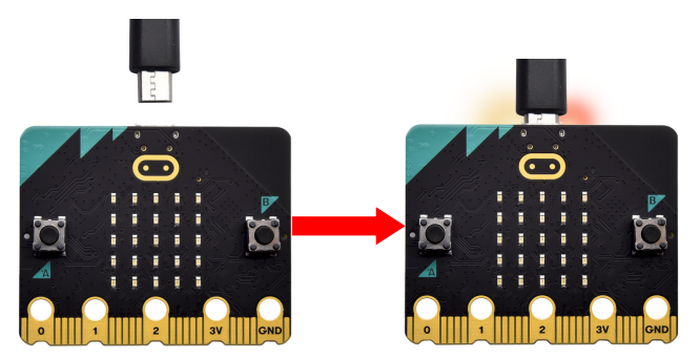
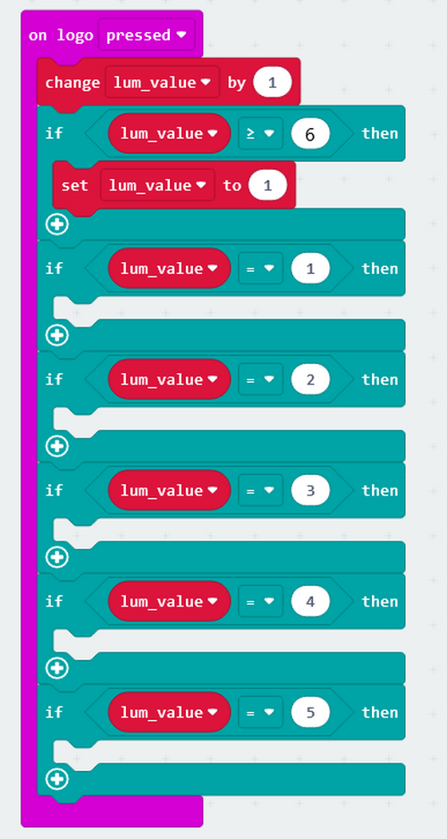
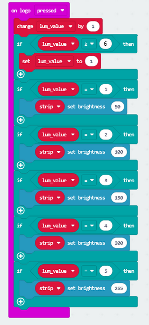
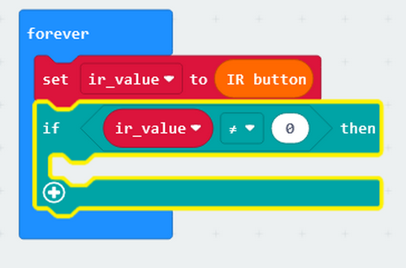
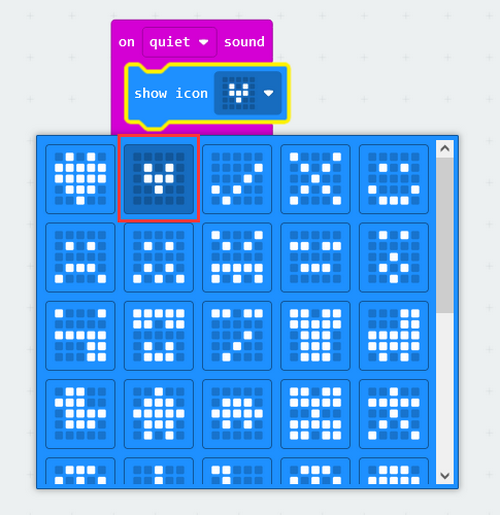

# Micro:bit Board Colorful Lamp Projects

## 1. Projects

Code download:  [Code](./MakeCode/code.zip)

### 1.1 RGB Module

1.1.1 Description

6812 2x2 full-color RGB module can be regarded as an intelligent external controlled LED light source, which integrates a control circuit and a light emitting circuit. Each pixel on it can be driven individually. Because it adopts single-line communication, this module can be controlled by only one signal pin.

1.1.2 Schematic Diagram

1.1.3 Parameters

- Operating voltage: DC3.3 or 5V
- Current: ≤200mA（MAX）
- Grey levels: 256 levels
- Emitting angle: 180°

1.1.4 Wiring Diagram

1.1.5 Test Code 1

Add an Extension.

Input <https://github.com/microsoft/pxt-neopixel>

And search to load the Extension.

As follows:

Choose pin P2 and 4 leds.

**Complete code**:

1.1.6 Light Effect 1

Upload the code to the board.

The lamp will light up in the color you set.

1.1.7 Test Code 2

1. Initialize RGB module.

2.

3.

4.

5. You may modify the pause time to set the changing duration of colors.

**Complete code**:

1.1.8 Light Effect 2

Upload the code to the board.

The lamp will turn on in colorful lights.

------

### 1.2. Button Control Lamp

There are two buttons (A and B) and a touch logo on the board. In this experiment, we change light colors with button A and B, and adjust brightness by touching the logo.

1.2.1 Test Code 1

Initialize RGB module.

Create a variable named **button_value**.

Assign 0 to the variable as its initial value.

Add two button-pressed blocks.

Press button A, value minus 1. Press button B, value adds 1.

Put an "if...then..." block. When the variable is smaller than 0, set it to 0. If the variable is greater than 5, set it to 5. Do it like this so the button value will be maintained within 0-5.

**Button blocks**:

Add "if...then..." block in "forever" to determine button values.

Set the colors of RGB module.

**Complete code**:

1.2.2  Light Effect 1

Upload the code to the board.

Press button A and B to change the colors of the lamp.

1.2.3 Test Code 2

Based on last experiment, we add codes to adjust the brightness of the RGB module.

Define a vriable named **lum_value**.

Assign 1 to the variable as its initial value.

Add a logo-pressed block.

For each time we touch the logo, the variable will adds 1. Reset the variable to 1 until it equals 6.

Add blocks to set the brightness.

**Complete code**:

1.2.4  Light Effect 2

Upload the code to the board.

Press button A or B to change the color of the lamp; touch the logo to adjust its brightness.

------

### 1.3. Remote Control Lamp

1.3.1 Description

Infrared remote control is one of the most widely used means of communication and remote control. This IR receiver module features small size, low power consumption, strong function and low cost, so it is adopted in many toys, such as the recorders, audio devices and air conditioners.

The transmitting circuit in the IR receiver is composed of an infrared light-emitting diode, which is responsible for emitting the modulated infrared waves.

The receiving circuit includes an infrared receiving diode and a triode/a silicon photocell, which receives the modulated infrared waves emitted by the transmitter and then converts them into electrical signals. These signals are then amplified, filtered, and demodulated to restore the encoded instructions. After being decoded, they will be read and recognized by the main board to perform the corresponding operations.

1.3.2 Parameters

Operating voltage: DC 3.3 ~ 5V

Operating Current: 1.5 mA

Maximum power: 0.0075 W

Carrier frequency: 38 KHz

Wave length: 940 λp（nm）

Receiving distance: 6m at 45 degree, 14m in parallel. 

Operating temperature: -10°C ~ +50°C

1.3.3 Wiring Diagram

1.3.4 Test Code 1

Import IR module library.

Input and search <https://github.com/keyestudio2019/MiniCar> to load the Extension.

Initialize the IR receiver module.

Initialize the USB serial port.

Define a variable named **ir_value** to store the infrared values received by the module.

If the variable does not equal 0, the module receives infrared signals and serial monitor prints these values.

Print values on USB serial monitor.

**Complete code**:

1.3.5 Test Result 1

Upload the code to the board.

Open the serial monitor and set baud rate. Align the remote control with the infrared receiver and press the buttons, and corresponding values will be received and displayed.

Corresponding button codes:

1.3.6 Test Code 2

We extend some codes on the basis of the previous program.

Add an Extension.

Input <https://github.com/microsoft/pxt-neopixel>

And search it to load the Extension.

Two libraries will be loaded:

Create two functions to control the light colors and brightness respectively. 

Define two variables to separately store colors and brightness of the lamp.

Set initial values to these two variables.

The received values will be displayed so that you can clearly know which button is pressed.

Set the corresponding colors and brightness for each button.

**RGB Function**:

Press button ↓ and the brightness will decrease by 50; press button ↑ and the brightness will increase by 50.

Put these two functions in "forever".

**Complete code**:

1.3.7  Light Effect 2

Upload the code to the board.

Press the up and down button to control the brightness; press the button 1-5 to change the colors of the light.

------

### 1.4. Sound Control Lamp

The board integrates a microphone which can detects ambient sound. 

In this experiment, we build a smart lamp. When a human makes a sound and it is detected, the lamp automatically turn on.

------

1.4.1 Test Code 1

Add two sound input blocks: one is load and another is quiet.

Set thresholds of the two inputs.

**Complete code**:

1.4.2 Light Effect 1

Upload the code to the board.

Clap your hands to make some sounds. When the board detects it, The dot matrix will show a large heart icon.

1.4.3 Test Code 2

We add a duration of the lighting time on the basis of the previous experiment. When we make a sound, the lamp lights up for 10s. 10 seconds later, the lamp will turn off if no sound is detected.

Add an Extension.

Input <https://github.com/microsoft/pxt-neopixel>

Tap Enter to search and load the Extension.

Initialize RGB module, set the RGB brightness to 255, and set the sound value threshold to 100.

The longer the pause time you set, the longer the lighting time will be.

At last, add a block to turn off the lamp.

**Complete code**:

1.4.4  Light Effect 2

Upload the code to the board. When we make a sound, the lamp lights up for 10s. 10 seconds later, the lamp will turn off.	

------

## 2. Troubleshooting

### 2.1  Code fails to download to Micro:bit

**Problem**

Recently, many users encounter the issue that Micro:bit board doesn’t respond when download code.

If the way you operate is correct, maybe you accidentally press the reset button and enter the Maintenance mode or the firmware is lost due to mis-operation.

Plug in Micro:bit board, the “MAINTENANCE” drive appears, which means the program can’t be downloaded.

**Solution**

1. Download the **hex file** from this page to your computer.

	Down load the latest micro:bit firmware-0255: <https://www.microbit.org/get-started/user-guide/firmware/>
	If you do not want to download from this website, we also provide it in our tutorial.

2. After the latest firmware is downloaded, then drag it into the “MAINTENANCE” to make Micro:bit back to normal mode.

**Avoid to Enter “MAINTENANCE”**

1. Make sure the Reset button is **not** pressed when plugging the board by USB cable.

      
      

2. Don't unplug the cable suddenly during downloading micro:bit program, otherwise, the firmware will be lost and micro:bit will enter “MAINTENANCE” mode.
3. In the experiment, wrong wiring also cause a short circuit or firmware lost.

------

### 2.2 Troubleshooting-Download with WebUSB

Having trouble pairing the Micro: bit with WebUSB (/ device/usb/webusb)?

**Step 1: Check cable**

Make sure that your micro:bit is connected to your computer with a micro USB cable. You should see a **MICROBIT** drive appear in Windows Explorer when it’s connected.

**If you can see the MICROBIT, please go to step 2**.

If you can’t:

- Make sure that the USB cable is working. Does the cable works on another computer? If not, find a different cable to use. Some cables may only provide a power connection and don’t actually transfer data.
- Try another USB port on your computer. 
- Is the cable good but you still can’t see the **MICROBIT** drive? Hmm, you might have a problem with your micro:bit. 
- Try the additional steps described in the [falut finding](https://support.microbit.org/support/solutions/articles/19000024000-fault-finding-with-a-micro-bit) at microbit.org.
- If this doesn’t help, you can create a [support ticket](https://support.microbit.org/support/tickets/new) to notify the Micro:bit Foundation of the problem. If you do so, **skip the rest of these steps**.

------

**Step 2: Check firmware version**

It’s possible that the firmware version on the micro:bit needs an update. Let’s check:

1. Go to the **MICROBIT** drive.
2. Open the **DETAILS.TXT** file.

3. Look for the version number. It should say **Version: ...**

Or **Interface Version: ...**

If the version is **0234**, **0241**, **0243**, you need to update the firmware (/device/firmware) on your micro:bit. Go to **Step 3** and follow the upgrade instructions.

If the version is **0249**, **0250** or higher, you have the right firmware, just go to **step 4**.

------

**Step 3: Update firmware**

1. Put your micro:bit into **MAINTENANCE Mode**. 

	To do this, please unplug the USB cable from the micro:bit and then re-connect the USB cable after pressing and holding the reset button. Once you insert the cable, you can release the reset button. You should now see **MAINTENANCE** instead of the **MICROBIT** drive. Also, a yellow LED indicator will stay on. 

2. Download firmware .hex file: <https://microbit.org/guide/firmware/>
3. Drag the file into the **MAINTENANCE** drive.
4. The yellow LED will flash while the HEX file is copying. After that, the LED will go off and the micro:bit resets. The **MAINTENANCE** drive now changes to **MICROBIT**.
5. The upgrade is complete! You can open the **DETAILS.TXT** file to check the firmware version that matches the one of the **HEX** file you copied.

If you want to know more about connecting the board, MAINTENANCE Mode, and upgrading the firmware, please refer to [Firmware guide](https://microbit.org/guide/firmware/).

------

**Step 4: Check version of Browser**

WebUSB may require you to update your browser. 

Check that your browser version matches one of these: **Android**, **Chrome OS**, **Linux**, **macOS** and **Windows 10 Chrome 65+**. 

------

**Step 5: Pair device**

Once you’ve updated the firmware, open the **Chrome Browser**, go to the editor and click on **Pair Device** in settings. 

See [WebUSB](https://microbit.org/get-started/user-guide/web-usb/) (/ device / usb / webusb) for pairing instructions.

