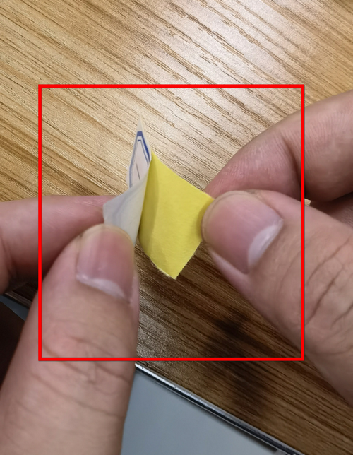
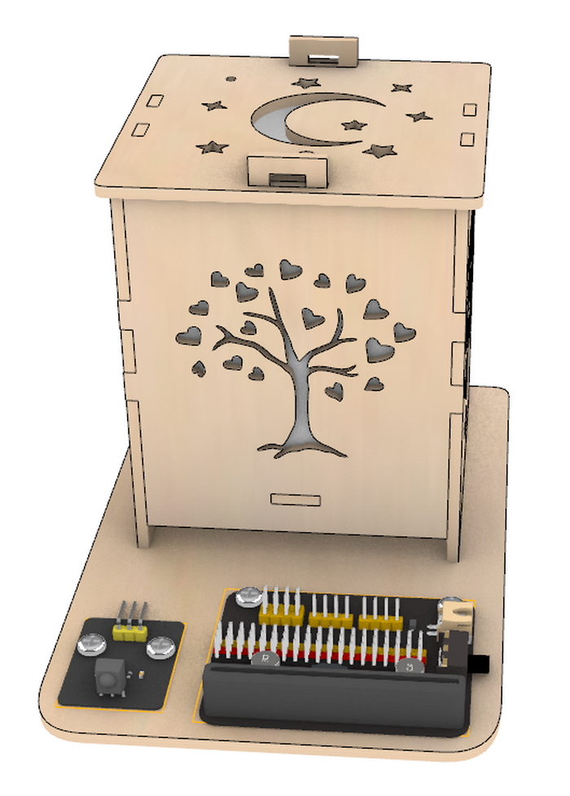
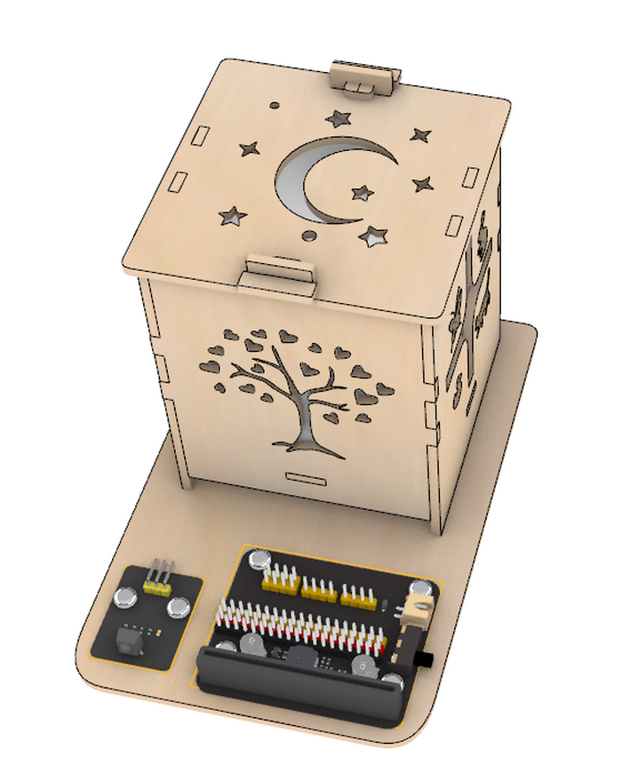

**Thank you for choosing keyestudio!**
 
**We will endeavor to provide you with better products and services!**

------

**About Keyestudio**

Keyestudio is the best-selling brand owned by KEYES Corporation. Our product contains Arduino development and expansion boards, sensors and modules, Raspberry Pi, micro:bit expansion boards as well as smart cars and learning kits, which can help customers at any level to learn about Arduino.

Notably, all of our products are in line with international quality standards and are greatly appreciated in a broad menu of different markets across the world.

Welcome to check out more contents from our official website:

[http://www.keyestudio.com](http://www.keyestudio.com)

------

**Obtain Information and After-sales Service**

1. Code Download:

   [Microbit](Microbit/MakeCode/code.zip)

   <!--[ESP32](ESP32/Code/code.zip)-->

2. If something is found missing or broken, or you have some difficulty learning the kit, please feel free to contact us. Welcome to send email to us: [service@keyestudio.com](http://m.138.gz.cn/webadmin/~CAmsnCrrNXhTAySKCerrIfWjjZuuWVfI/~/usr/mod_edituser.jsp?;uid=service@keyestudio.com;;clearCache=)

3. We will endeavor to update projects and products continuously from your sincere advice! Thanks!

------

**Warning**

1. This product contains tiny pin headers, so please keep out of reach of children under 7 to prevent from lacerations. 
2. This product also contains conductive parts(control board and electronic modules). Please operate according to the requirements of tutorials. Otherwise, improper operation may damage parts due to overheating. In this case, do not touch it and immediately disconnect the circuit power.

------

**Copyright**

The Keyestudio trademark and logo are the copyright of **KEYES DIY ROBOT co.,LTD**. All products under Keyestudio brand can’t be copied, sold or resold without authorization by anyone or any company.

If you are interested in our products, please contact to our sales representatives:

[fennie@keyestudio.com](http://m.138.gz.cn/webadmin/~CAmsnCrrNXhTAySKCerrIfWjjZuuWVfI/~/usr/mod_edituser.jsp?;uid=fennie@keyestudio.com;;clearCache=)

------

# STEM Programming DIY Colorful Lamp Learning Kit

------

## Kit List

**Please check the list to ensure that all parts are intact. If you find missing ones, please contact our sales staff immediately.**

|  #   |                             PIC                              |           NAME           | QTY  |
| :--: | :----------------------------------------------------------: | :----------------------: | :--: |
|  1   |                                            |     Expansion board      |  1   |
|  2   |                                            |      Battery holder      |  1   |
|  3   |                                            |         Basswood         |  1   |
|  4   |  | M4*12mm round head screw |  6   |
|  5   |                          | M4*8mm round head screw  |  2   |
|  6   |  |          M4 nut          |  8   |
|  7   |                          |     3PIN DuPont wire     |  2   |
|  8   |                                            |        RGB module        |  1   |
|  9   |                                            |       IR receiver        |  1   |
|  10  |                                           |       Screwdriver        |  1   |
|  11  |                                           |      Remote control      |  1   |
|  12  |                                           |        Paper slip        |  1   |

------

## Description

With bass wood as its structural material, we specially design a colorful lamp learning kit.

This kit integrates an RGB module and IR receiver, which are compatible with micro:bit boards and ESP32 Easy Coding Boards. We write codes via Makecode and KidsBlock to emit colors or to achieve more creative and interesting functions.

With this kit, you can master basic sensor knowledge and have an excellent opportunity to learn programming. Except for the creation of light shows, it is also a perfect combination of learning and entertainment which stimulates your creativity and talent.

------

## Features

1. **Simple assembly:** For convenience, the assembly is easy and simple so that you may complete installations quickly.
2. **Experience of colorful lamp:** You can experience lamp to emit colors and enjoy the fun of light show.
3. **Combination of programming and light:** It integrates colors with programming, providing you with a novel and creative programming experience.
4. **Multiple programming:** Makecode and KidsBlock programming are available, which meet the diversified programming needs and expand the range of learning.

------

## Assembly

**step 1**

**step 2**

**step 3**

**step 4**

**When wiring up, please note the colors of wires: S to yellow; V to red; G to black.**

​	Wire up

| Expansion board | IR receiver | RGB module |
| :----: | :------------: | :-----: |
|   S    |    P12/io15    | P2/io32 |
|  3V3   |       V        |    V    |
|  GND   |       G        |    G    |

Install batteries (prepare four AAA batteries in advance by yourself)

**step 5**

**step 6**

Follow the tutorial to unfold the square paper in the kit

NOTE: If the paper slip doesn't fit the inner walls of the basswood boards, please tape them up.

**step 7**

## Resources

[https://www.keyestudio.com/](https://www.keyestudio.com/)

[https://wiki.keyestudio.com/Main_Page](https://wiki.keyestudio.com/Main_Page)

[Micro:bit Educational Foundation | micro:bit (microbit.org)](https://microbit.org/)

[https://www.espressif.com/](https://www.espressif.com/)

------

## Tutorials

Download tutorials and codes: 

[Microbit](Microbit/MakeCode/code.zip)

[ESP32](ESP32/Code/code.zip)

**1.Basic Projects**

Basic projects include development board introduction, programming methods, the ways of burning codes and the usage of sensors and modules. You will have a clear understanding on the board functions.

If you are a beginner, please firstly read the introduction and using methods of development board (Micro:bit /ESP32Easy Coding Board) to learn how to program on software and how to upload code.

[Basic Courses: Microbit](Microbit/Basic_Courses.md)

<!--[Basic Courses: ESP32 Easy Coding Board](ESP32/Basic_Courses.md)-->

**2.Colorful Lamp Projects**

Do operations according to the tutorials of the two development boards.

**2.1.Microbit Tutorial**

[Micro:bit](Microbit/Microbit.md)

**2.2 ESP32 Easy Coding Board Tutorial**

[ESP32](ESP32/ESP32.md)

------

